# The Research Diagram Playbook

---
title: "The Research Diagram Playbook"
subtitle: "A Complete Guide to UML Diagram Selection, Generation & Integration for Academic Publications"
type: playbook
author: Rishab Chhetri
badge: TECHNICAL PLAYBOOK
cta_url: https://www.zobique.com/contact
---

## What This Playbook Covers

!!! tip "Inside This Guide"
    - A structured **decision framework** for selecting the right UML diagrams for your research paper
    - **6 core diagram types** with syntax, use cases, and academic placement guidance
    - A **tool comparison matrix** (Mermaid, draw.io, Eraser AI, Figma) with honest trade-offs
    - A **3-phase production workflow** from concept draft to publication-ready export
    - **Common mistakes** that get papers rejected — and how to avoid every one of them
    - Ready-to-use **Mermaid templates** for each diagram type

---

## Why Diagrams Matter in Research

A well-constructed diagram is not decoration — it is **evidence of architectural thinking**.

Reviewers at IEEE, Springer, and Elsevier evaluate diagrams for:

| Criteria | What Reviewers Look For |
|----------|------------------------|
| **Clarity** | Can the system be understood in under 30 seconds? |
| **Standard Compliance** | Does it follow UML 2.x notation? |
| **Completeness** | Are all critical components and interactions represented? |
| **Consistency** | Are fonts, arrows, labels, and colors uniform? |
| **Relevance** | Does the diagram add information the text alone cannot? |

!!! warning "The Hard Truth"
    A paper with **zero diagrams** signals that the author either lacks system design maturity or did not invest in communicating their architecture. Both are red flags for reviewers.

---

## Part 1: The Diagram Taxonomy

UML diagrams split into two families. Understanding this split is the first step to selecting the right ones.


**Structural Diagrams** answer: *"What does the system look like?"*
**Behavioral Diagrams** answer: *"How does the system act?"*

A strong research paper needs **both** — structure without behavior is a blueprint no one can operate, and behavior without structure is a story with no setting.

---

## Part 2: Structural Diagrams — System Design Focus

### 2.1 Class Diagram

**Purpose:** Model the static structure of a system — its classes, attributes, methods, and relationships.

| Aspect | Detail |
|--------|--------|
| **Best For** | Object-oriented systems, backend architecture, database abstraction, AI agent components |
| **Paper Section** | Methodology, System Design |
| **Academic Value** | Proves architectural clarity and object decomposition rigor |
| **When to Skip** | Purely functional systems, script-based pipelines with no class hierarchy |

**Mermaid Template:**


**Key Notation Rules:**

| Symbol | Meaning |
|--------|---------|
| `+` | Public |
| `-` | Private |
| `#` | Protected |
| `-->` | Association |
| `<\|--` | Inheritance |
| `*--` | Composition |
| `o--` | Aggregation |

!!! info "Academic Tip"
    Always include **method signatures with return types**. A class box with only attribute names signals a shallow design.

---

### 2.2 Component Diagram

**Purpose:** Show the high-level modular architecture — how subsystems, services, and packages interact.

| Aspect | Detail |
|--------|--------|
| **Best For** | Microservices, AI pipelines, multi-module systems, API-based architecture |
| **Paper Section** | System Overview, Architecture |
| **Academic Value** | Demonstrates modular thinking and separation of concerns |
| **When to Skip** | Monolithic single-file scripts |

**Mermaid Template:**


!!! tip "Design Principle"
    Group components into **named subgraphs** (layers). This immediately communicates architectural layering — a detail reviewers actively look for.

---

### 2.3 Deployment Diagram

**Purpose:** Map software components to physical or cloud infrastructure.

| Aspect | Detail |
|--------|--------|
| **Best For** | Cloud-based systems, distributed systems, AI SaaS platforms |
| **Paper Section** | Implementation, Deployment |
| **Academic Value** | Proves the system is not theoretical — it runs somewhere real |
| **When to Skip** | Purely algorithmic papers with no deployment context |

**Mermaid Template:**


!!! warning "Common Mistake"
    Do not confuse a Component Diagram with a Deployment Diagram. Components show **logical modules**. Deployment shows **where those modules physically run** (servers, containers, regions).

---

## Part 3: Behavioral Diagrams — System Behavior Focus

### 3.1 Use Case Diagram

**Purpose:** Define the functional scope of a system — what actors exist and what they can do.

| Aspect | Detail |
|--------|--------|
| **Best For** | User interaction flow, system actors, feature overview |
| **Paper Section** | Problem Statement, Requirements, Scope |
| **Academic Value** | Explains functional boundaries clearly and concisely |
| **When to Skip** | Internal microservice papers with no direct user interaction |

**Mermaid Template:**



```mermaid
graph LR
    Student["🎓 Student"]
    Recruiter["🏢 Recruiter"]
    Admin["⚙️ Admin"]
    
    Student --> UC1["Upload Resume"]
    Student --> UC2["View Matched Jobs"]
    Student --> UC3["Track Applications"]
    
    Recruiter --> UC4["Post Job Opening"]
    Recruiter --> UC5["Search Candidates"]
    Recruiter --> UC6["Schedule Interview"]
    
    Admin --> UC7["Manage Users"]
    Admin --> UC8["View Analytics"]
    
    UC2 --> AI["AI Matching Engine"]
    UC5 --> AI
    
    style AI fill:#6C3CE1,color:#fff,stroke:none
```

!!! info "Notation Note"
    Mermaid does not natively support UML use case ovals. For drafting, `graph LR` with descriptive nodes works. For final submission, rebuild in **draw.io** with proper UML use case shapes (ellipses for use cases, stick figures for actors).

---

### 3.2 Sequence Diagram

**Purpose:** Show the time-ordered interaction between components for a specific workflow.

| Aspect | Detail |
|--------|--------|
| **Best For** | API workflows, AI inference pipelines, authentication processes |
| **Paper Section** | Methodology, System Behavior |
| **Academic Value** | Shows dynamic behavior — the "runtime story" of your system |
| **When to Skip** | Systems with no meaningful inter-component communication |

**Mermaid Template:**


**Key Notation Rules:**

| Arrow | Meaning |
|-------|---------|
| `->>` | Synchronous request |
| `-->>` | Response / return |
| `--)` | Asynchronous message |
| `Note over` | Inline annotation |
| `activate / deactivate` | Lifeline activation |

!!! tip "Academic Best Practice"
    Always label arrows with the **actual API endpoint or method name**, not vague descriptions like "sends data." Specificity signals implementation maturity.

---

### 3.3 Activity Diagram

**Purpose:** Model process flows, decision points, and parallel execution paths.

| Aspect | Detail |
|--------|--------|
| **Best For** | Process flows, ML training pipelines, decision-based workflows |
| **Paper Section** | Methodology, Algorithm Explanation |
| **Academic Value** | Simplifies complex multi-step workflows into scannable visual logic |
| **When to Skip** | Linear CRUD systems with no branching logic |

**Mermaid Template:**


!!! info "Diagram Distinction"
    **Activity Diagram** = process flow (what happens step by step, with branches).
    **Sequence Diagram** = interaction flow (who talks to whom, in what order).
    Use Activity for **algorithms**. Use Sequence for **API calls**.

---

## Part 4: Diagram Selection Matrix

### By Research Domain

| Paper Topic | Recommended Diagrams | Minimum Count |
|-------------|---------------------|---------------|
| **AI System / Career Platform** | Use Case + Component + Deployment + Class + Activity + Sequence | 5–6 |
| **ML Model / Algorithm Paper** | Activity + Sequence + Class | 3 |
| **Web Application / SaaS** | Component + Deployment + Sequence + Use Case | 4 |
| **Mobile App** | Use Case + Sequence + Component | 3 |
| **Distributed System** | Deployment + Component + Sequence + Activity | 4 |
| **Data Pipeline / ETL** | Activity + Component + Deployment | 3 |

### By Paper Section

| Paper Section | Primary Diagram | Secondary Diagram |
|---------------|----------------|-------------------|
| **Problem Statement & Scope** | Use Case Diagram | — |
| **System Overview** | Component Diagram | Deployment Diagram |
| **Architecture / Design** | Class Diagram | Component Diagram |
| **Methodology / Workflow** | Activity Diagram | Sequence Diagram |
| **Implementation** | Deployment Diagram | Sequence Diagram |
| **API / Integration** | Sequence Diagram | Component Diagram |

!!! tip "The Gold Standard"
    For a publication targeting IEEE, Springer, or Elsevier — include **6 diagrams** (one of each type). This signals comprehensive system thinking and sets your paper apart from text-heavy submissions.

---

## Part 5: Tool Comparison & Selection

### Head-to-Head Matrix

| Criteria | Mermaid | draw.io | Eraser AI | Figma |
|----------|---------|---------|-----------|-------|
| **UML Compliance** | ⭐⭐⭐ | ⭐⭐⭐⭐⭐ | ⭐⭐⭐ | ⭐⭐ |
| **Speed of Drafting** | ⭐⭐⭐⭐⭐ | ⭐⭐⭐ | ⭐⭐⭐⭐⭐ | ⭐⭐ |
| **Visual Polish** | ⭐⭐⭐ | ⭐⭐⭐⭐ | ⭐⭐⭐⭐ | ⭐⭐⭐⭐⭐ |
| **Version Control** | ⭐⭐⭐⭐⭐ | ⭐⭐ | ⭐⭐ | ⭐ |
| **Export Quality** | ⭐⭐⭐⭐ (SVG) | ⭐⭐⭐⭐⭐ | ⭐⭐⭐ | ⭐⭐⭐⭐ |
| **LaTeX Integration** | ⭐⭐⭐⭐⭐ | ⭐⭐⭐⭐ | ⭐⭐ | ⭐⭐ |
| **Learning Curve** | Moderate | Low | Very Low | Moderate |
| **Cost** | Free | Free | Freemium | Freemium |
| **Offline Support** | Yes | Yes (Desktop) | No | No |

---

### Tool Deep Dives

#### Mermaid

| Aspect | Assessment |
|--------|------------|
| **Strengths** | Code-based (Git-friendly), lightweight, renders inside Markdown and LaTeX, excellent for rapid iteration |
| **Weaknesses** | Limited styling control, complex diagrams become visually cluttered, no native UML use case shape |
| **Best For** | Technical CS conference papers, draft/concept phase, documentation |
| **Verdict** | **Phase 1 tool** — fast iteration, not final submission quality for top journals |

#### draw.io (diagrams.net)

| Aspect | Assessment |
|--------|------------|
| **Strengths** | Full UML shape library, precise alignment control, professional export (SVG/PDF/PNG at 300+ DPI), free |
| **Weaknesses** | Manual effort, time-consuming for first draft, no code-based workflow |
| **Best For** | Final submission diagrams for IEEE/Springer/Elsevier publications |
| **Verdict** | **Phase 2 tool** — the standard for publication-ready UML |

#### Eraser AI

| Aspect | Assessment |
|--------|------------|
| **Strengths** | AI-assisted generation from natural language, fast prototyping, clean default aesthetics |
| **Weaknesses** | AI output may violate UML standards, limited fine-grained control, export limitations |
| **Best For** | Quick concept exploration, stakeholder communication |
| **Verdict** | **Prototyping tool** — useful for brainstorming, not for final academic deliverables |

#### Figma

| Aspect | Assessment |
|--------|------------|
| **Strengths** | Beautiful custom designs, full creative control, excellent for presentations and posters |
| **Weaknesses** | No native UML shapes, requires manual compliance, overkill for standard papers |
| **Best For** | Conference slides, poster sessions, visual abstracts |
| **Verdict** | **Presentation tool** — not for strict UML in research papers |

---

## Part 6: The 3-Phase Production Workflow


### Phase 1 — Concept Design (Mermaid / Eraser AI)

**Goal:** Get the architecture out of your head and into a visual form — fast.

| Step | Action | Tool |
|------|--------|------|
| 1 | Write diagram logic in Mermaid syntax | VS Code + Mermaid Preview Extension |
| 2 | Iterate on relationships and component naming | Mermaid Live Editor (mermaid.live) |
| 3 | Share with co-authors for structural feedback | Markdown file in Git repo |
| 4 | Finalize the logical structure before polishing | — |

!!! tip "Speed Hack"
    Use Eraser AI to generate a first draft from a natural language description, then convert it to Mermaid syntax for version control.

### Phase 2 — Final Polishing (draw.io)

**Goal:** Rebuild each diagram with proper UML notation, alignment, and visual hierarchy.

| Step | Action | Checklist |
|------|--------|-----------|
| 1 | Open draw.io (desktop or web) | — |
| 2 | Select UML shape library | Ensure UML 2.x shapes are active |
| 3 | Rebuild diagram from Mermaid draft | Match all components and relationships |
| 4 | Apply consistent styling | See Style Guide below |
| 5 | Add legend if using color coding | Bottom-left corner, bordered box |
| 6 | Peer review for readability | "30-second rule" — is it clear at a glance? |

**Style Guide for draw.io:**

| Element | Standard |
|---------|----------|
| **Font** | Arial or Helvetica, 10–12pt |
| **Arrow Style** | Solid for synchronous, dashed for async/return |
| **Colors** | Max 4 colors. Must be distinguishable in grayscale |
| **Labels** | Every arrow and component must be labeled |
| **Alignment** | Use grid snapping. No floating elements |
| **Whitespace** | Generous padding between components |

### Phase 3 — Paper Integration

**Goal:** Export and embed diagrams at publication quality.

| Step | Action | Standard |
|------|--------|----------|
| 1 | Export as **SVG** (preferred) or **PNG at 300 DPI** | Vector > raster for print |
| 2 | Test **grayscale rendering** | Print in B&W — are all elements distinguishable? |
| 3 | Verify **text readability** at printed paper size | No label should be smaller than 8pt when printed |
| 4 | Add **figure caption** in paper | "Fig. X: [Diagram Type] of [System Component]" |
| 5 | Cross-reference in text | "As shown in Fig. X, the system architecture..." |
| 6 | Place diagram **near first reference** in text | Do not cluster all diagrams at the end |

!!! warning "Export Pitfall"
    PNG exports at screen resolution (72 DPI) will look **pixelated in print**. Always export at **300 DPI minimum** or use SVG.

---

## Part 7: Common Mistakes & How to Avoid Them

| # | Mistake | Why It's Bad | Fix |
|---|---------|-------------|-----|
| 1 | **Too many arrows** | Visual noise — reviewer cannot trace flow | Limit to essential relationships. Use subgraphs to reduce cross-cutting lines |
| 2 | **Mixing diagram types** | Putting sequence logic inside a class diagram confuses notation | One diagram = one type. Period. |
| 3 | **No legend** | Color-coded diagrams without a key are inaccessible | Add a bordered legend box in the bottom-left corner |
| 4 | **Small unreadable text** | Diagrams are often shrunk to fit columns — tiny text disappears | Minimum 10pt in source. Test at 50% zoom |
| 5 | **Inconsistent notation** | Mixing arrow styles, font sizes, or color schemes across diagrams | Create a style sheet and apply uniformly to all 6 diagrams |
| 6 | **No figure captions** | Reviewers cannot reference your diagrams in feedback | Every diagram gets "Fig. N:" with a descriptive caption |
| 7 | **Decorative diagrams** | Diagrams that restate what the text already says add no value | Each diagram must convey information that text alone **cannot** |
| 8 | **Screenshot exports** | Blurry, aliased, non-scalable | Always use native export (SVG/PDF/PNG at 300 DPI) |
| 9 | **Color-only encoding** | Inaccessible to colorblind readers and B&W print | Use shape + pattern + label in addition to color |
| 10 | **Orphan diagrams** | Diagrams never referenced in the body text | Every figure must be cited: "As shown in Fig. X..." |

---

## Part 8: Quick-Reference Cheat Sheet

### Which Diagram Do I Need?

```
I want to show...
│
├── WHO uses the system and WHAT they can do
│   └── ✅ Use Case Diagram
│
├── WHAT modules/services exist and how they connect
│   └── ✅ Component Diagram
│
├── WHERE the system runs (servers, cloud, containers)
│   └── ✅ Deployment Diagram
│
├── WHAT classes/objects exist and their relationships
│   └── ✅ Class Diagram
│
├── HOW components interact over time for a workflow
│   └── ✅ Sequence Diagram
│
└── HOW a process flows step-by-step with decisions
    └── ✅ Activity Diagram
```

### Which Tool Do I Use?

```
I need to...
│
├── Draft quickly and iterate
│   └── ✅ Mermaid (code-based, Git-friendly)
│
├── Generate a first concept from a description
│   └── ✅ Eraser AI (AI-assisted)
│
├── Create publication-ready UML diagrams
│   └── ✅ draw.io (full UML library, precise control)
│
└── Make beautiful conference presentation slides
    └── ✅ Figma (design-first, not UML-strict)
```

### The Minimum Viable Diagram Set

For a research paper that demonstrates serious system architecture:

| # | Diagram | Demonstrates |
|---|---------|-------------|
| 1 | **Use Case** | Functional scope and actors |
| 2 | **Component** | Modular architecture |
| 3 | **Deployment** | Real-world infrastructure |
| 4 | **Class** | Object model and relationships |
| 5 | **Sequence** | Runtime interaction |
| 6 | **Activity** | Process logic and decisions |

!!! tip "The Takeaway"
    **6 diagrams. 3 structural + 3 behavioral. Draft in Mermaid. Polish in draw.io. Export as SVG.**
    That is the entire workflow. Everything else is optimization.

---

## Appendix A: Mermaid Syntax Quick Reference

### Graph / Flowchart

```text
graph TD           %% Top-Down
graph LR           %% Left-Right
A["Label"] --> B   %% Arrow
A --> |"text"| B   %% Labeled arrow
A --- B            %% Line (no arrow)
A -.- B            %% Dotted line
A ==> B            %% Thick arrow
subgraph "Name"    %% Grouping
end
```

### Sequence Diagram

```text
sequenceDiagram
    actor User
    participant API
    User->>API: Request        %% Sync call
    API-->>User: Response      %% Return
    User--)API: Async Event    %% Async
    Note over API: Processing  %% Note
    activate API               %% Lifeline start
    deactivate API             %% Lifeline end
```

### Class Diagram

```text
classDiagram
    class ClassName {
        +String attribute
        -int privateAttr
        +method(param) ReturnType
    }
    ClassA <|-- ClassB     %% Inheritance
    ClassA *-- ClassC      %% Composition
    ClassA o-- ClassD      %% Aggregation
    ClassA --> ClassE      %% Association
    ClassA ..> ClassF      %% Dependency
```

---

## Appendix B: Recommended Resources

| Resource | URL | Purpose |
|----------|-----|---------|
| **Mermaid Live Editor** | [mermaid.live](https://mermaid.live) | Real-time Mermaid rendering and export |
| **draw.io** | [app.diagrams.net](https://app.diagrams.net) | Publication-ready diagramming |
| **Eraser AI** | [eraser.io](https://eraser.io) | AI-assisted diagram generation |
| **PlantUML** | [plantuml.com](https://plantuml.com) | Alternative code-based UML (Java-based) |
| **UML 2.5.1 Spec** | [omg.org/spec/UML](https://www.omg.org/spec/UML) | Official UML standard reference |
| **IEEE Template** | [ieee.org/conferences](https://www.ieee.org/conferences/publishing/templates.html) | Paper formatting templates |

---

*Built by Rishab Chhetri, Zobique. Because your research deserves diagrams as rigorous as your methodology.*
