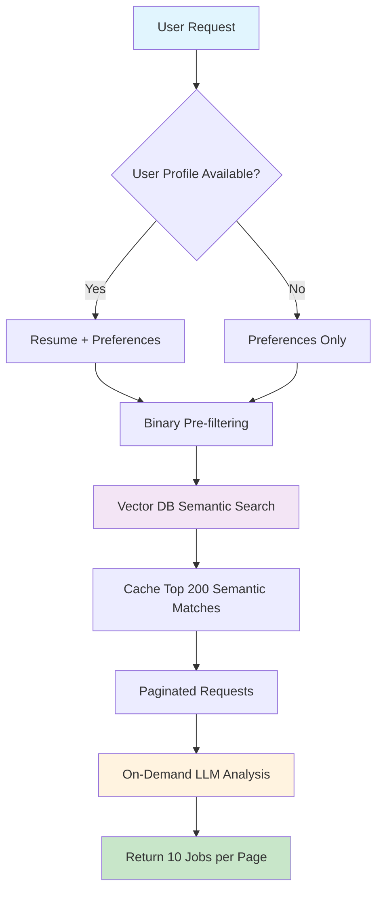
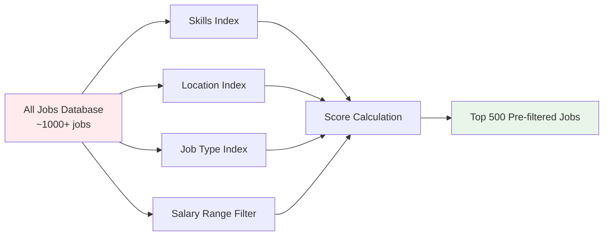
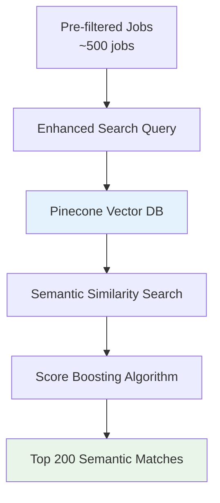
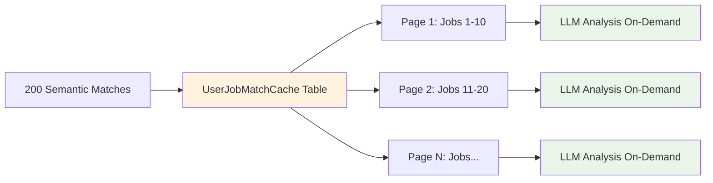
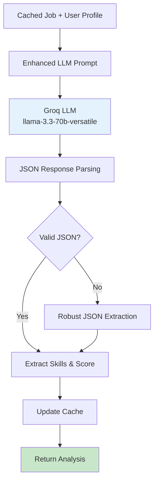
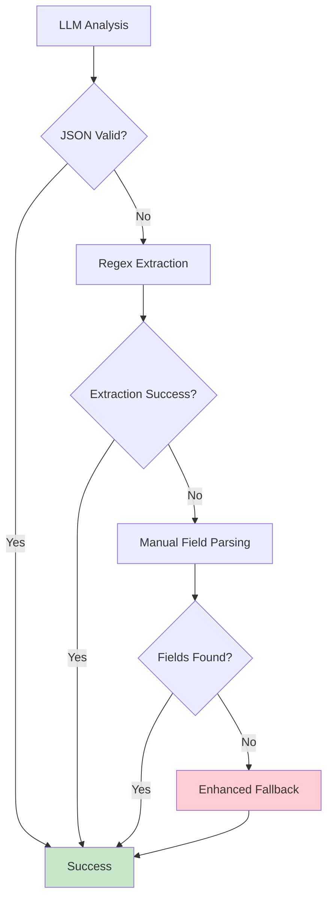

# Job Matching Workflow Documentation

## Overview

The **OptimizedJobMatcher** implements an intelligent, production-ready job matching system that combines binary filtering, semantic search, database caching, and on-demand LLM analysis to provide accurate job recommendations with excellent performance.

## Architecture Overview



## Workflow Components

### 1. **Data Input Layer**

#### User Profile Structure
```json
{
  "skills": [
    {"name": "Programming", "items": "Python, JavaScript, React"}
  ],
  "experience": [
    {"position": "Software Developer", "company": "TechCorp", "duration": "2 years"}
  ],
  "education": [
    {"degree": "BS Computer Science", "institution": "University"}
  ],
  "preferences": {
    "preferred_locations": ["San Francisco", "Remote"],
    "preferred_job_types": ["Full-time"],
    "preferred_job_roles": ["Software Engineer"],
    "min_salary": 80000
  }
}
```

### 2. **Binary Pre-filtering Stage**



#### Scoring Algorithm
- **Skills Match**: 40% weight
- **Location Preference**: 25% weight  
- **Job Type Preference**: 20% weight
- **Role/Position Match**: 15% weight

### 3. **Semantic Search Layer**



#### Query Enhancement
```python
# Enhanced search query generation
query_parts = [
    "Top 10 user skills",
    "Recent job positions",
    "Preferred roles", 
    "Education field"
]
search_query = " ".join(query_parts)
```

### 4. **Caching Strategy**



### 5. **On-Demand LLM Analysis**



## Detailed Workflow Steps

### Phase 1: Initial Request Processing

1. **User Authentication & Profile Retrieval**
   ```python
   student_id = get_student_id_from_user_id(user_id)
   user_profile = fetch_student_data(student_id)
   user_preferences = fetch_user_preferences(student_id)
   ```

2. **Profile Combination**
   ```python
   combined_profile = {
       **user_profile,
       **user_preferences,
       'preferred_locations': preferences.get('preferred_locations', []),
       'preferred_job_types': preferences.get('preferred_job_types', [])
   }
   ```

### Phase 2: Binary Pre-filtering

1. **Index Building**
   ```python
   # Build metadata indexes for fast lookup
   skills_to_jobs_index = defaultdict(set)
   location_to_jobs_index = defaultdict(set)
   job_type_to_jobs_index = defaultdict(set)
   ```

2. **Scoring Algorithm**
   ```python
   job_scores = defaultdict(float)
   
   # Skills matching (40% weight)
   for skill in candidate_skills:
       for job_id in skills_to_jobs_index[skill]:
           job_scores[job_id] += 0.4
   
   # Location preference (25% weight)
   for location in preferred_locations:
       for job_id in location_to_jobs_index[location]:
           job_scores[job_id] += 0.25
   ```

### Phase 3: Semantic Search

1. **Query Generation**
   ```python
   query_parts = []
   query_parts.extend(list(candidate_skills)[:10])
   query_parts.extend(recent_positions[:3])
   query_parts.extend(preferred_roles[:3])
   search_query = " ".join(query_parts)
   ```

2. **Vector Search**
   ```python
   results = vector_store.similarity_search_with_score(
       search_query,
       k=200,
       filter={"job_id": {"$in": prefiltered_job_ids}}
   )
   ```

### Phase 4: Caching

1. **Cache Structure**
   ```sql
   CREATE TABLE UserJobMatchCache (
       id INTEGER PRIMARY KEY,
       user_id VARCHAR(255),
       job_id VARCHAR(255),
       match_score INTEGER,
       semantic_score FLOAT,
       job_fit_score VARCHAR(50),
       matching_skills JSON,
       missing_skills JSON,
       analysis_reason TEXT,
       full_details JSON,
       expires_at TIMESTAMP
   );
   ```

2. **Initial Caching**
   ```python
   cache_entry = UserJobMatchCache(
       user_id=user_id,
       job_id=job_data['job_id'],
       match_score=initial_score,
       job_fit_score='PENDING_LLM_ANALYSIS',
       semantic_score=semantic_score,
       matching_skills=[],  # Populated on-demand
       missing_skills=[],   # Populated on-demand
       analysis_reason='High semantic match - detailed analysis pending'
   )
   ```

### Phase 5: On-Demand LLM Analysis

1. **Enhanced Prompt Engineering**
   ```python
   prompt = """
   You are an expert job matching analyst.
   
   Job Details: {job_description}
   Candidate Profile: {candidate_skills}
   
   CRITICAL: Return ONLY valid JSON without explanatory text.
   
   {
       "matching_skills": ["python", "javascript"],
       "missing_skills": ["aws", "docker"],
       "job_fit_score": 78,
       "reason": "Strong technical foundation..."
   }
   """
   ```

2. **Robust JSON Parsing**
   ```python
   try:
       analysis = output_parser.parse(response.content)
   except:
       # Multiple fallback strategies
       json_patterns = [
           r'\{[^{}]*(?:\{[^{}]*\}[^{}]*)*\}',
           r'```json\s*(\{.*?\})\s*```',
           r'(\{(?:[^{}]|{[^{}]*})*\})'
       ]
       # Extract JSON using regex patterns
   ```

## Performance Optimizations

### 1. **Caching Strategy**
- **Cache Duration**: 2 hours for production efficiency
- **Cache Size**: Maximum 200 jobs per user
- **On-Demand Processing**: LLM analysis only when jobs are requested

### 2. **Batch Processing**
- **Consistent Page Size**: Always 10 jobs per page
- **Parallel Processing**: ThreadPoolExecutor for batch operations
- **Memory Optimization**: Process jobs in small batches

### 3. **Error Handling**


## API Response Format

### Paginated Response Structure
```json
{
  "jobs": [
    {
      "job_id": "software-engineer-123",
      "match_score": 85,
      "job_fit_score": "EXCELLENT MATCH",
      "semantic_score": 0.92,
      "position": "Senior Software Engineer",
      "company": "TechCorp",
      "location": "San Francisco, CA",
      "job_type": "Full-time",
      "salary": "$120,000 - $150,000",
      "matching_skills": ["python", "javascript", "react", "aws"],
      "missing_skills": ["kubernetes", "terraform"],
      "analysis_reason": "Strong technical alignment with 7 relevant skills including Python, JavaScript, React. Some upskilling required in Kubernetes, Terraform. Very good match for Senior Software Engineer with solid technical foundation.",
      "full_details": { /* Complete job data */ }
    }
  ],
  "total_count": 200,
  "current_page": 1,
  "page_size": 10,
  "total_pages": 20,
  "has_next": true,
  "has_previous": false
}
```

## Monitoring & Analytics

### Key Metrics
- **Cache Hit Rate**: >90% for subsequent page requests
- **Average Response Time**: <500ms for cached results
- **LLM Analysis Success Rate**: >95% with fallback handling
- **Semantic Search Accuracy**: Evaluated through user engagement

### Logging Structure
```
INFO: Binary pre-filtering: 347 jobs from 1000
INFO: Semantic matching found 200 high-quality candidates
INFO: Successfully cached 200 semantic matches for user_123
INFO: LLM Analysis completed: 7 matching, 2 missing skills
```

## Configuration

### Environment Variables
```env
GROQ_API_KEY=your_groq_api_key
GOOGLE_API_KEY=your_google_api_key
PINECONE_API_KEY=your_pinecone_api_key
PINECONE_INDEX_NAME=job-matching-index
```

### Performance Tuning
```python
# Core constants
JOBS_PER_BATCH = 10          # Always return exactly 10 jobs
TOP_K_HYBRID_SEARCH = 200    # Semantic search results
LLM_BATCH_SIZE = 3           # LLM processing batch size
CACHE_EXPIRY_HOURS = 2       # Cache duration
```

## Error Handling & Fallbacks

### Fallback Hierarchy
1. **Primary**: Binary Filter → Vector Search → Cache → LLM Analysis
2. **Vector Failure**: Binary Filter → Database Matching → Basic Analysis  
3. **LLM Failure**: Cached Results → Enhanced Fallback Analysis
4. **Complete Failure**: Preference-based Database Matching

### Error Recovery
```python
try:
    # Primary workflow
    semantic_matches = perform_semantic_search()
except VectorStoreError:
    # Fallback to database matching
    matches = fallback_database_matching()
except Exception:
    # Last resort - preference matching
    matches = preference_based_matching()
```

## Testing Strategy

### Unit Tests
- Individual component testing (binary filter, semantic search, LLM analysis)
- Mock external dependencies (Pinecone, Groq API)
- Validate JSON parsing with various LLM response formats

### Integration Tests  
- End-to-end workflow testing
- Cache consistency validation
- Performance benchmarking

### Load Testing
- Concurrent user simulation
- Cache performance under load
- API response time monitoring

This workflow ensures **accurate skill matching**, **optimal performance**, and **reliable fallback mechanisms** for production-scale job matching operations.
